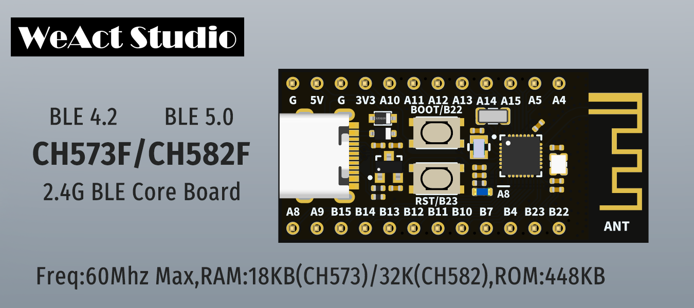

* [English version](./README.md)
# WeActStudio.WCH-BLE-Core

CH573F
> 60Mhz Max,18KB RAM,448KB ROM,RISC-V3A,BLE 4.2

CH582F
> 60Mhz Max,20KB RAM,64KB ROM,RISC-V4A,BLE 5.0

WCH 官方网站 www.wch.cn(zh-CN) / www.wch-ic.com(en)

|目录名称|内容|
| :--:|:--:|
|Doc| 数据手册/参考手册|
|HDK| 硬件开发资料|
|SDK|软件开发资料|
|Examples|软件例程|

## 如何下载程序
方法
1. 安装`Tools`目录下的`WCHISPTool_Setup.exe`
2. 安装`Tools`目录下的`CH372DRV.EXE`或者从`http://www.wch.cn/downloads/CH372DRV_EXE.html`下载
3. 按住BOOT键然后用USB数据线连接电脑，释放BOOT键
4. 打开 `WCHISPTool` && 找到 `CH57x Series` 或 `CH58x Series`

```
/*---------------------------------------
- WeAct Studio Official Link
- taobao: weactstudio.taobao.com
- aliexpress: weactstudio.aliexpress.com
- github: github.com/WeActTC
- gitee: gitee.com/WeAct-TC
- blog: www.weact-tc.cn
---------------------------------------*/
```